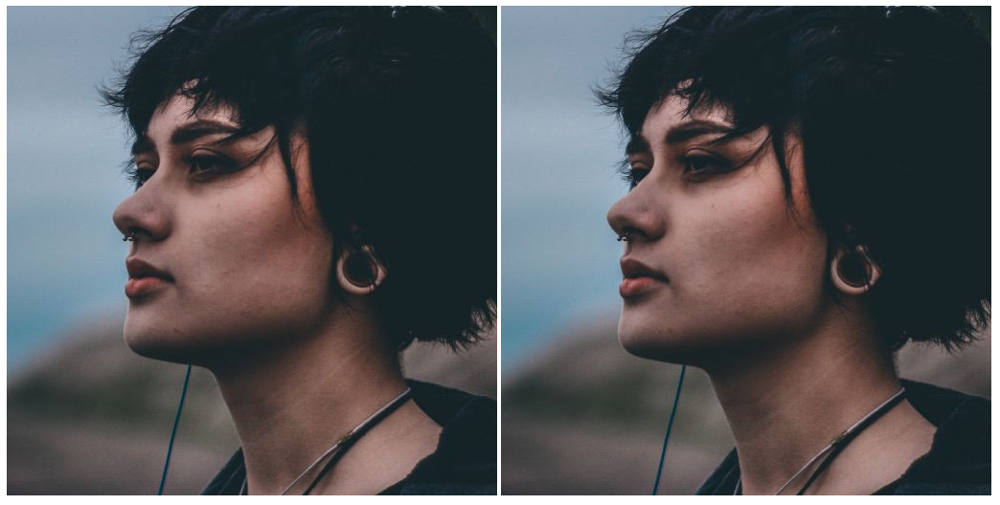

# Firefox CSS url() filter issue

According to [Can I Use](https://caniuse.com/css-filters) and [MDN](https://developer.mozilla.org/en-US/docs/Web/CSS/filter) Firefox supports `filter: url(link#id)` expressions for defining filters.
This minimal working example shows that is not always correct.

Set up the project by:

```console
pnpm install
pnpm run dev
```

Use for example Chrome to view the website at <localhost:5173>:


Now try the same with Firefox:



The filters are stored in [src/assets](src/assets/) and loaded in [App.svelte](src/App.svelte).

This issue was first experienced by [Skeleton](https://skeleton.dev), which led me to create this minimal working example.
See a dedicated discussion here: [Why are filters not supported in Firefox?](https://github.com/skeletonlabs/skeleton/discussions/1426).
